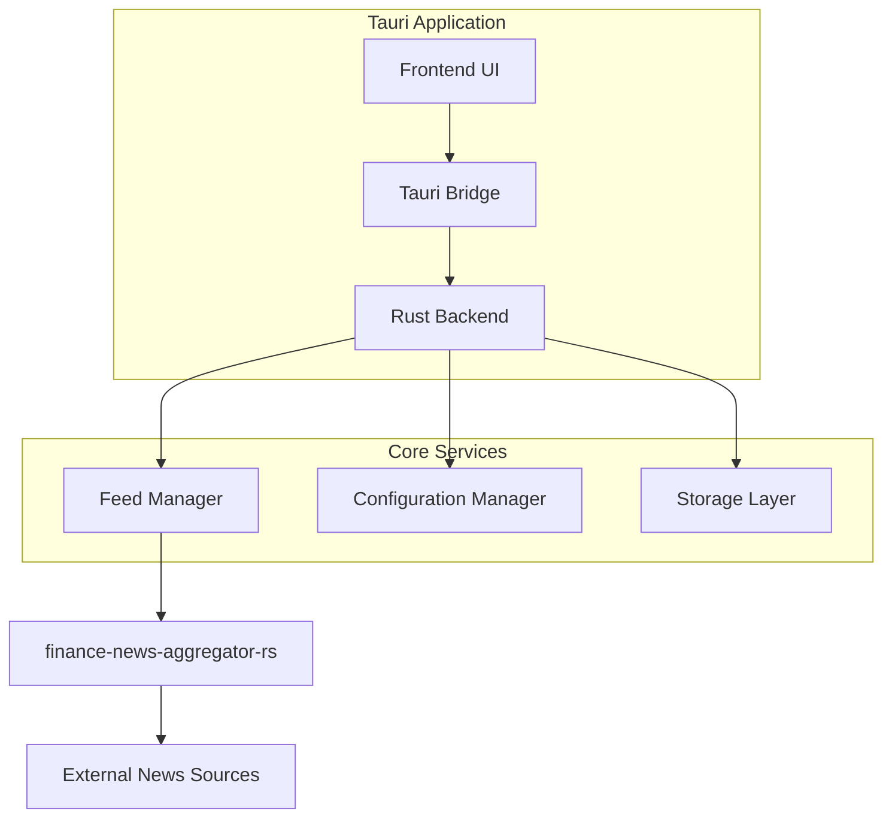

# Design Document

## Overview

The Desktop Feed Reader is a cross-platform desktop application built with Tauri framework, combining a Rust backend for feed processing with a modern web frontend. The application leverages the finance-news-aggregator-rs crate for news aggregation and provides a clean, responsive interface for consuming financial news from multiple sources.

## Architecture

### High-Level Architecture



### Technology Stack

- **Frontend**: HTML/CSS/JavaScript (or TypeScript) with modern web technologies
- **Backend**: Rust with Tauri framework
- **News Aggregation**: finance-news-aggregator-rs crate
- **Storage**: SQLite for local data persistence
- **Configuration**: JSON-based configuration files
- **Cross-platform**: Tauri provides native desktop applications for Windows, macOS, and Linux

## Components and Interfaces

### 1. Frontend Components

#### Main Application Window
- **News Feed Display**: Scrollable list of articles with title, summary, date, and source
- **Toolbar**: Contains refresh button, settings access, and status indicators
- **Settings Panel**: Configuration interface for feeds and refresh settings
- **Article Viewer**: Detailed view for selected articles

#### Key Frontend Interfaces
```typescript
interface Article {
  id: string;
  title: string;
  summary: string;
  content?: string;
  url: string;
  source: string;
  publishedAt: Date;
  isRead: boolean;
}

interface FeedSource {
  id: string;
  name: string;
  url: string;
  enabled: boolean;
  lastFetched?: Date;
}

interface AppConfig {
  autoRefreshEnabled: boolean;
  autoRefreshInterval: number; // minutes
  enabledSources: string[];
  theme: 'light' | 'dark' | 'system';
}
```

### 2. Rust Backend Components

#### Feed Manager Service
- Orchestrates news fetching using finance-news-aggregator-rs
- Manages refresh timers and scheduling
- Handles feed source configuration
- Processes and normalizes article data

#### Configuration Manager
- Loads and saves application settings
- Manages feed source configurations
- Handles user preferences persistence

#### Storage Service
- SQLite database operations for articles and metadata
- Caching mechanism for offline access
- Data cleanup and maintenance

#### Tauri Commands Interface
```rust
#[tauri::command]
async fn get_articles(limit: Option<u32>) -> Result<Vec<Article>, String>;

#[tauri::command]
async fn refresh_feeds() -> Result<RefreshResult, String>;

#[tauri::command]
async fn update_config(config: AppConfig) -> Result<(), String>;

#[tauri::command]
async fn get_feed_sources() -> Result<Vec<FeedSource>, String>;

#[tauri::command]
async fn toggle_feed_source(source_id: String, enabled: bool) -> Result<(), String>;
```

## Data Models

### Database Schema

```sql
-- Articles table
CREATE TABLE articles (
    id TEXT PRIMARY KEY,
    title TEXT NOT NULL,
    summary TEXT,
    content TEXT,
    url TEXT NOT NULL,
    source_id TEXT NOT NULL,
    published_at DATETIME NOT NULL,
    fetched_at DATETIME DEFAULT CURRENT_TIMESTAMP,
    is_read BOOLEAN DEFAULT FALSE,
    FOREIGN KEY (source_id) REFERENCES feed_sources (id)
);

-- Feed sources table
CREATE TABLE feed_sources (
    id TEXT PRIMARY KEY,
    name TEXT NOT NULL,
    url TEXT NOT NULL,
    enabled BOOLEAN DEFAULT TRUE,
    last_fetched DATETIME,
    created_at DATETIME DEFAULT CURRENT_TIMESTAMP
);

-- Application configuration
CREATE TABLE app_config (
    key TEXT PRIMARY KEY,
    value TEXT NOT NULL,
    updated_at DATETIME DEFAULT CURRENT_TIMESTAMP
);
```

### Configuration File Structure

```json
{
  "autoRefresh": {
    "enabled": true,
    "intervalMinutes": 30
  },
  "feedSources": [
    {
      "id": "reuters-finance",
      "name": "Reuters Finance",
      "url": "https://feeds.reuters.com/reuters/businessNews",
      "enabled": true
    }
  ],
  "ui": {
    "theme": "system",
    "articlesPerPage": 50,
    "showNotifications": true
  }
}
```

## Error Handling

### Network Error Handling
- Implement exponential backoff for failed requests
- Cache last successful fetch results
- Display user-friendly error messages
- Maintain application functionality during network outages

### Data Validation
- Validate feed URLs before adding sources
- Sanitize article content for display
- Handle malformed RSS/Atom feeds gracefully
- Validate configuration file integrity

### Error Recovery Strategies
```rust
pub enum FeedError {
    NetworkError(String),
    ParseError(String),
    ConfigurationError(String),
    StorageError(String),
}

impl FeedError {
    pub fn user_message(&self) -> String {
        match self {
            FeedError::NetworkError(_) => "Unable to connect to news sources. Please check your internet connection.".to_string(),
            FeedError::ParseError(_) => "Error processing news feed. The source may be temporarily unavailable.".to_string(),
            FeedError::ConfigurationError(_) => "Configuration error. Please check your settings.".to_string(),
            FeedError::StorageError(_) => "Database error. Please restart the application.".to_string(),
        }
    }
}
```

## Testing Strategy

### Unit Testing
- Test individual Rust modules (feed manager, configuration, storage)
- Mock external dependencies (finance-news-aggregator-rs)
- Test error handling scenarios
- Validate data transformation logic

### Integration Testing
- Test Tauri command interfaces
- Verify frontend-backend communication
- Test database operations and migrations
- Validate configuration loading and saving

### End-to-End Testing
- Test complete user workflows (add source, refresh feeds, read articles)
- Verify auto-refresh functionality
- Test application startup and shutdown
- Validate cross-platform compatibility

### Performance Testing
- Measure feed fetch performance with multiple sources
- Test memory usage with large article datasets
- Validate UI responsiveness during background operations
- Test application startup time

## Security Considerations

### Data Protection
- Sanitize all external content before display
- Validate URLs to prevent malicious redirects
- Implement secure storage for sensitive configuration
- Use HTTPS for all external requests

### Application Security
- Leverage Tauri's security features and CSP
- Minimize exposed Tauri commands
- Validate all input parameters
- Implement proper error handling without information leakage